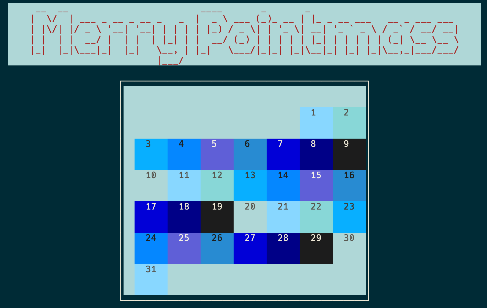

# Merry point-mass

This is a GitHub repository created to accompany [this livestream](https://www.youtube.com/watch?v=8U0gg6-plSM).

It's 2023 and everyone is cuckoo for points. So I thought a fun workshop project would be to build a retro CLI points advent calendar.

This project:

-   Permanently stores Proof of Points using [Irys SDK](https://docs.irys.xyz/developer-docs/irys-sdk)
-   Verifies point counts using [Irys signed receipts](https://docs.irys.xyz/learn/receipts)
-   Generates real-time point counts with [Irys query package](https://docs.irys.xyz/developer-docs/querying/query-package)
-   Makes an old-school CLI ... just for fun

## Installation

1. Clone this repository
2. Change `.env.example` to `.env` and add a EVM private key. This can be a throwaway key and does not need to be funded, it is only used to sign transactions
3. `npm install`

## Running

1. `node scripts/pointmass.js ______` And add a EVM wallet address

## Yes, this is a demo

There are two main files in this project:

-   `scripts/pointmass.js` - [CLI UI build using blessed](https://github.com/chjj/blessed)
-   `scripts/pointmass-irys.js` - Functions to store points onchain using Irys and query point counts using the Irys query package

So, yeah, this is a demo. Everything executes on the client side, including storage of points and random number generation. That's obviously not very secure, but it makes it easiser when teaching. There's a lot you'd want to do if you were actually going to use this to release a point promotion, first off you'd move the Irys functions to the server where you could control the code.

## More stuff

-   [Livestream teaching this repo](https://www.youtube.com/watch?v=8U0gg6-plSM)
-   [What is a provenance layer?](https://irys.xyz/blog/what-is-a-provenance-layer)
-   [Irys docs](https://docs.irys.xyz/)
-   [Build a provenance chain tutorial](https://docs.irys.xyz/hands-on/tutorials/provenance-chain)
-   [My Twitter](https://twitter.com/spaceagente)
